    Aplicatie web de evidentiere a metodelor CRUD pentru pagina de vizitare a unei gradini zoologice

1.	Introducere

În era digitală în care tehnologia evoluează rapid, dezvoltarea aplicațiilor web devine tot mai accesibilă și mai eficientă, aducând cu sine o serie de avantaje și oportunități pentru dezvoltatori și utilizatori deopotrivă. În acest context, crearea unei aplicații web care utilizează metodele CRUD (Create, Read, Update, Delete) pentru gestionarea datelor despre animale reprezintă un exemplu concret al modului în care tehnologia poate fi utilizată pentru a aduce beneficii palpabile în diverse domenii.
Scopul acestei aplicații este de a oferi utilizatorilor o platformă dinamică și eficientă pentru a gestiona și vizualiza informații legate de animale. Utilizând un formular simplu și intuitiv, utilizatorii pot adăuga, vizualiza, actualiza și șterge înregistrări despre animale, cum ar fi detalii precum numele, descrierea și țara de origine. Astfel, aplicația servește nu doar ca un instrument practic pentru gestionarea datelor, ci și ca o resursă utilă pentru pasionații de animale, crescătorii, sau oricine este interesat de informații legate de aceste creaturi fascinante.
Pentru a realiza această aplicație, sunt folosite tehnologii moderne și inovatoare, precum soluții cloud și cadre de lucru specializate, care aduc o serie de avantaje și beneficii în dezvoltarea și implementarea proiectului.

2.	Descrierea tehnologiilor cloud folosite

    MongoDB Cloud
MongoDB Cloud reprezintă o suită comprehensivă de servicii și instrumente oferite de MongoDB pentru a facilita stocarea, gestionarea și întreținerea bazelor de date non-relaționale (NoSQL) în medii de cloud computing. Această soluție este concepută pentru a oferi dezvoltatorilor și organizațiilor un mediu scalabil, sigur și eficient pentru gestionarea datelor lor, eliminând nevoia de a se ocupa de aspectele complicate ale administrării infrastructurii de bază de date.
-	MongoDB Atlas: Reprezinta serviciul principal oferit de MongoDB Cloud, ce furnizeaza o platforma completa de gestionare a bazelor de date MongoDB in cloud. MongoDB Atlas permite utilizatorilor sa creeze, sa configureze si sa gestioneze clustere MongoDB cu usurinta, oferind caracteristici avansate precum: scalabilitate automata, backup si restaurare, monitorizare si Securitate avansata. 
In realizarea aplicatiei, am creat pentru inceput un cont pe MongoDB Cloud, unde am creat un cluster (in cadrul aplicatiei cluster0). Ulterior am preluat API-ul clusterului pe care l-am folosit in MongoDB Compass pentru a crea o conexiune. In cadrul conexiunii, am creat baza de date ProiectCloud si, de asemenea, colectia records. API-ul l-am salvat in proiect in fisierul .env. API-ul folosit in proiect pentru a prelua conexiunea cu MongoDB Compass este salvat cu denumirea NEXT_ATLAS_URI, iar API-ul folosit pentru a prelua datele din baza de date create este denumit NEXT_ATLAS_DATABASE.
-	Scalabilitate orizontala: Unul dintre avantajele majore ale utilizării MongoDB Cloud este capacitatea de a scala baza de date orizontal, adăugând noduri suplimentare la cluster. Această scalabilitate orizontală permite aplicațiilor să facă față unor volumuri mari de date și trafic crescut fără a afecta performanța sau disponibilitatea.
-	Rezistenta si Redundanta: MongoDB Cloud oferă o redundanță ridicată a datelor, asigurând că informațiile stocate sunt protejate împotriva pierderii și coruperii. Datele sunt replicabile și distribuite în mai multe zone de disponibilitate, permițând recuperarea rapidă în caz de eșecuri sau întreținere planificată.
-	Securitate Avansata: Platforma MongoDB Cloud pune un accent deosebit pe securitatea datelor, oferind opțiuni avansate pentru autentificare, autorizare și criptare a datelor. Utilizatorii pot gestiona accesul la date și pot aplica politici de securitate personalizate pentru a proteja informațiile sensibile.
-	Flexibilitate si Integrare: MongoDB Cloud poate fi integrat cu ușurință într-o varietate de medii de dezvoltare și aplicații, permițând dezvoltatorilor să se concentreze pe crearea funcționalităților și experiențelor de utilizare, fără a fi nevoie să se preocupe de aspectele legate de administrarea infrastructurii de bază de date.

    Vercel 
Vercel reprezinta o platformă puternică de găzduire și dezvoltare pentru aplicații web statice și serverless, construită cu scopul de a simplifica procesul de dezvoltare, implementare și scalare a proiectelor web. Cu o serie de caracteristici și funcționalități avansate, Vercel oferă un mediu optim pentru dezvoltatorii web, permițându-le să creeze și să livreze aplicații web moderne și performante într-un mod eficient și simplu.
-	Implementare Simplificata: Vercel pune un accent deosebit pe simplificarea procesului de implementare a aplicațiilor web. Dezvoltatorii pot încărca proiectele lor direct din platforma lor de dezvoltare preferată (cum ar fi GitHub, GitLab sau Bitbucket) sau pot utiliza interfața de linie de comandă (CLI) pentru a implementa proiectele local. Implementarea este rapidă și fără probleme, iar Vercel se ocupă automat de configurarea infrastructurii și de gestionarea resurselor necesare.
-	Suport pentru Next.js si alte cadre de lucru: Vercel este strâns integrat cu cadre de lucru populare precum Next.js, oferind suport nativ pentru caracteristicile acestora și facilitând dezvoltarea aplicațiilor web moderne. Dezvoltatorii pot beneficia de toate avantajele oferite de cadrele de lucru preferate, în timp ce Vercel se ocupă de aspectele legate de infrastructură și de gestionarea serverelor.
-	Scalabilitate automata: Vercel gestionează automat scalabilitatea aplicațiilor web, asigurând că acestea rămân responsive și disponibile indiferent de volumul de trafic sau de cerințele de utilizare. Platforma utilizează tehnologii moderne de scalabilitate orizontală și gestionare a traficului pentru a asigura performanța și disponibilitatea aplicațiilor în orice moment.
-	Securitate Avansata: Vercel oferă opțiuni de securitate avansate pentru aplicațiile web găzduite pe platforma sa. Acestea includ suport pentru HTTPS, gestionarea automată a actualizărilor de securitate și protecție împotriva atacurilor de tip DDOS (Distributed Denial of Service), asigurând că datele și informațiile utilizatorilor sunt întotdeauna în siguranță.
-	Colaborare si Integrare simpla: Vercel facilitează colaborarea între membrii echipei de dezvoltare și oferă integrare cu o varietate de instrumente și servicii populare, precum Slack, Jira și GitHub. Dezvoltatorii pot lucra împreună într-un mediu colaborativ și pot integra ușor aplicațiile lor cu alte servicii și soluții pentru a extinde funcționalitățile acestora.

De asemenea, codul proiectului l-am incarcat pe GitHub, in repository-ul aferent acestuia (ProiectCloud). Link-ul catre repository: https://github.com/DeliaPaun/ProiectCloud.

Aplicatia am publicat-o pe Vercel, dupa ce am importat repository-ul corespunzator proiectului de pe GitHub (ProiectCloud). Link-ul catre aplicatie este: https://proiect-cloud-ten.vercel.app/.

3.	Prezentare workflow aplicatie

Prezentarea workflow-ului aplicatiei am realizat-o prin intermediul unui videoclip pe care l-am incarcat pe Youtube (ca nelistat). Link-ul catre prezentare este: https://www.youtube.com/watch?v=jGw5UUA_qIE.

4.	Capturi de ecran aplicatie

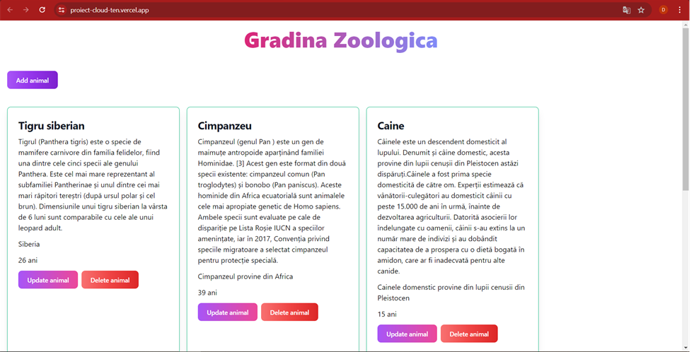
Fig. 4.1. Pagina de inceput a aplicatiei

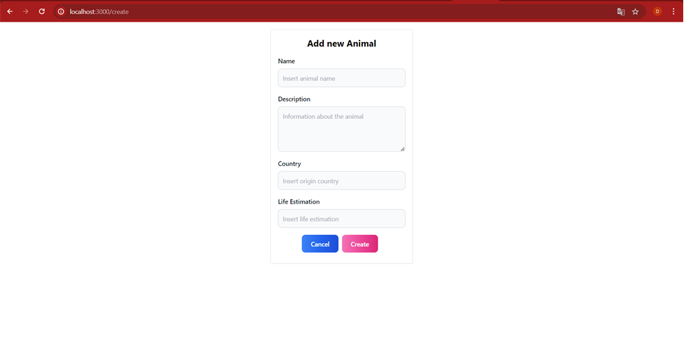
Fig. 4.2. Formularul de adaugare a unui nou animal

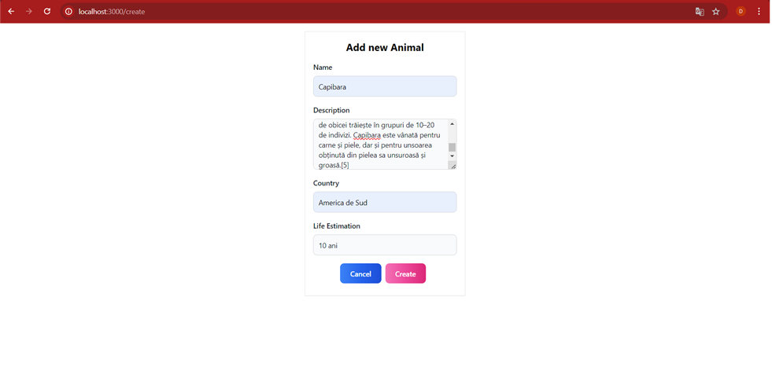
Fig. 4.3. Formularul de adaugare a unui capibara

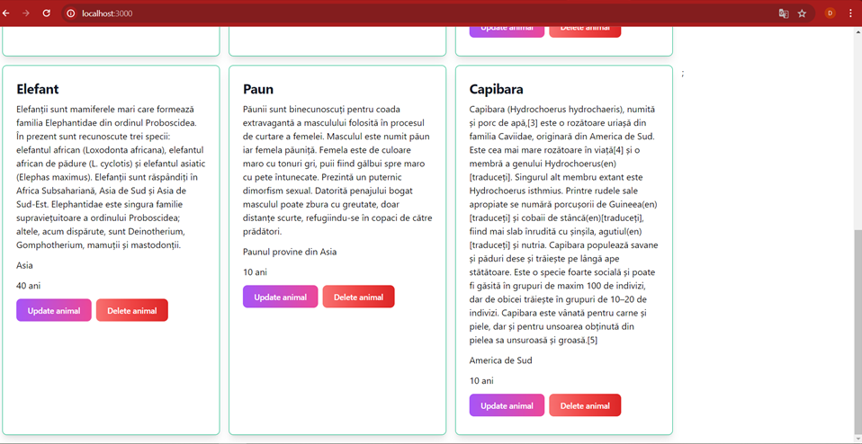
Fig. 4.4. Adaugarea inregistrarii pentru Capibara

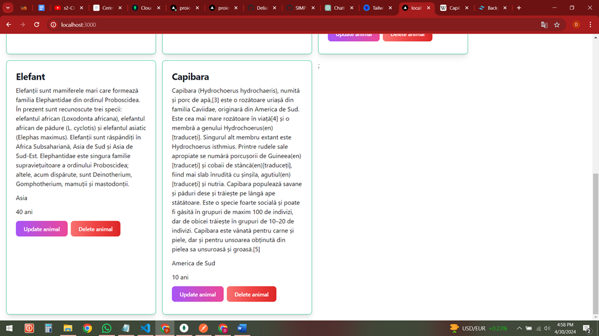
Fig. 4.5. Stergerea inregistrarii pentru Paun

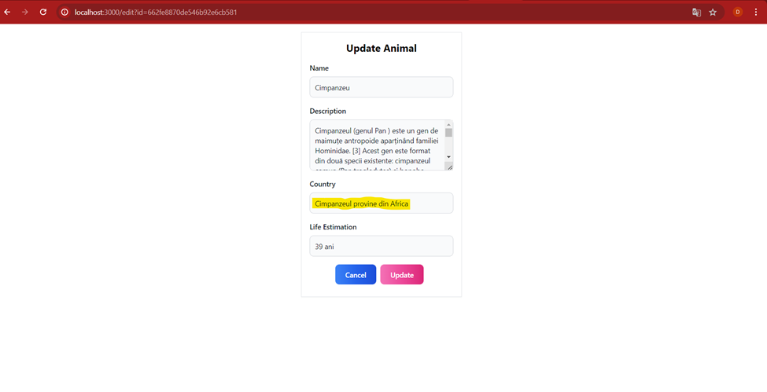
Fig. 4.6. Actualizarea inregistrarii pentru Cimpanzeu (inainte)

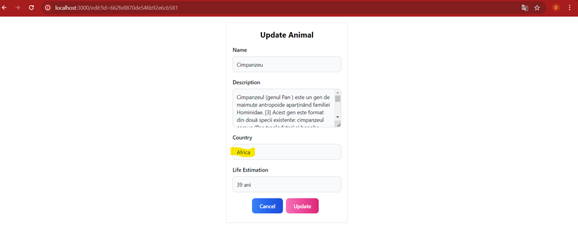
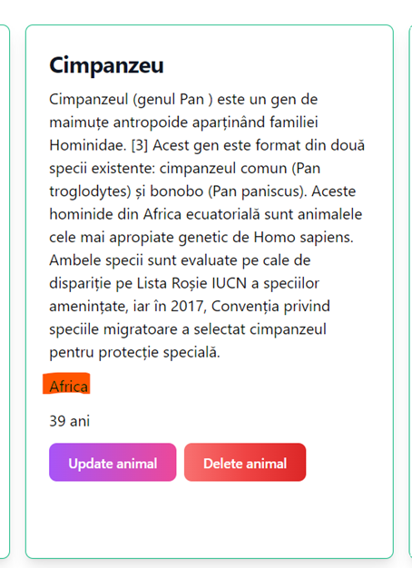
Fig. 4.7. Actualizarea inregistrarii pentru Cimpanzeu (dupa)

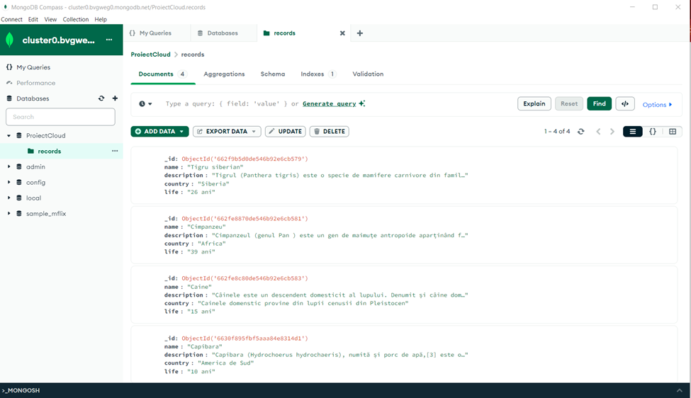
Fig. 4.8. Colectia records din MongoDB Compass

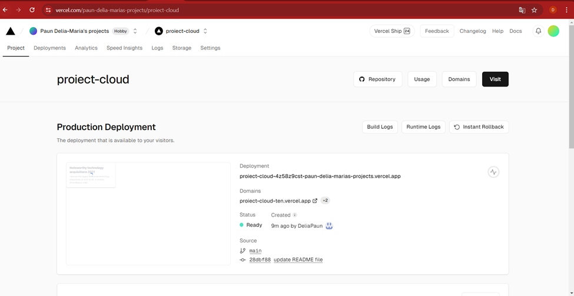
Fig. 4.9. Aplicatia publicata pe Vercel

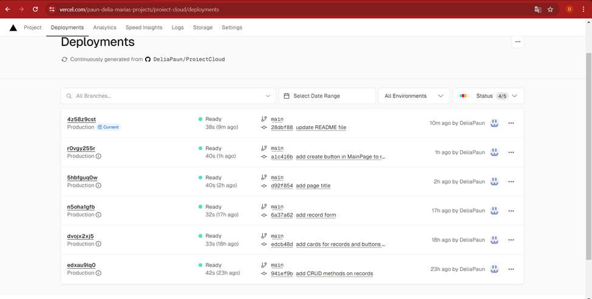
Fig. 4.10. Deployments pe Vercel

 
5.	Referinte

-	MongoDB Atlas, https://www.mongodb.com/cloud/atlas
-	Vercel, https://vercel.com/

